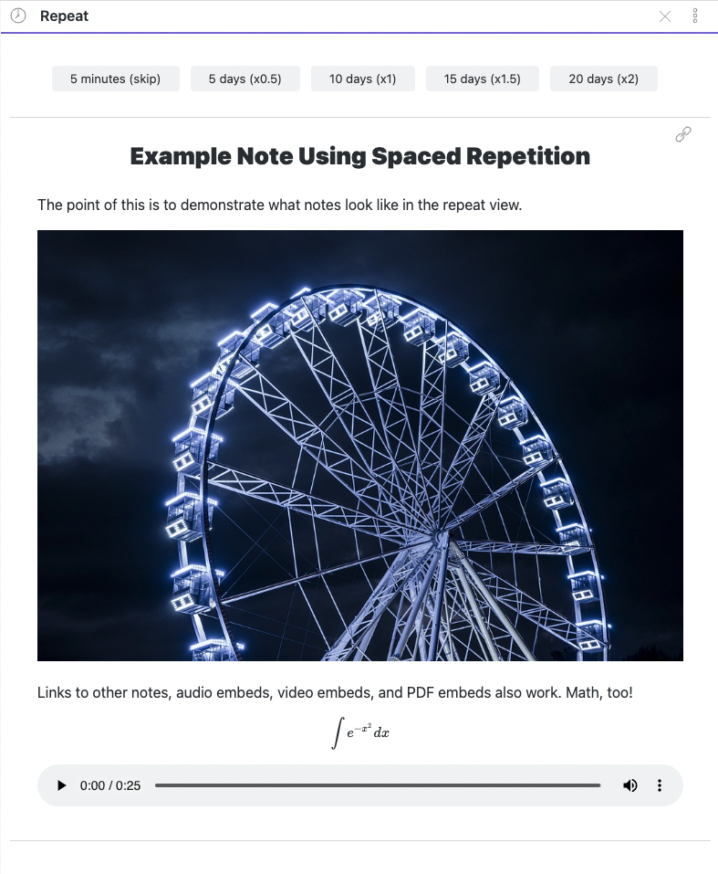
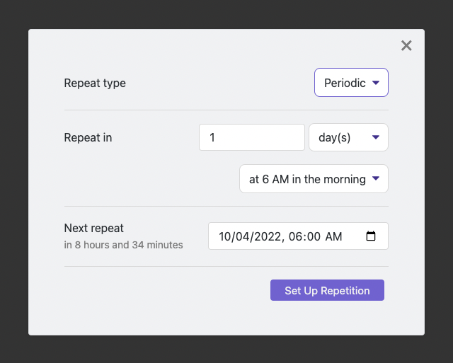

# Repeat Plugin for Obsidian

This plugin allows you to review notes using periodic or spaced repetition:

*   Reviews of notes using **periodic repetition** can occur daily, weekly, monthly, yearly, or every _K_  days/weeks/months/years. By default, periodic reviews become due early in the morning so that all periodic notes due on a given date become due at the same time.
*   Reviews of notes using **spaced repetition** occur on an dynamic schedule. You can choose how to modify a spaced note's review frequency at each review. For example, if the current review frequency is every 10 days, then you can choose the next review to occur in 5 days (0.5x), 10 days (1x), 15 days (1.5x), or 20 days (2x).

### Some Usage Examples

*   Review your journal entries every year to gain insights into what you were thinking about 1, 2, 3... years ago.
*   Surface weekly reminders for recurring tasks. E.g., review journal articles every Wednesday.
*   Create a book note when you start a new read. Then surface the note every few days and add your thoughts about the book so far.
*   Summarize a concept you wish to remember, then use spaced repetition to remember it in the long term.

### Installation

1.  Install the DataView plugin (which is used to query notes frontmatter).
2.  Install the Repeat plugin (this plugin).

## Reviewing Notes

Reviews are conducted through a **Repeat view** added by this plugin. To open the Repeat view, you can either click the "clock" icon in Obsidian's ribbon menu, or run the _Review due notes_ command.



## Choosing Notes to Repeat

To mark a note as repeating, you can use one of the following **commands** while editing a note:

*   _Repeat this note..._ lets you customize a note's repetition.
*   _Repeat this note every day_
*   _Repeat this note every week_
*   _Repeat this note every month_
*   _Repeat this note every year_

This is what the _Repeat this note..._ modal looks like:



Repetition state is stored in the `repeat` and `due_at` frontmatter fields.

```yaml
---
repeat: every 3 days
due_at: 2022-10-03T06:00:00.000-04:00
---
```

You can also create or edit these fields manually instead of via a command. If you add the `repeat` field to a note's frontmatter, the plugin will use some basic heuristics to figure out when its first review should be. After the first review, `due_at` is automatically populated with an [ISO datetime](https://github.com/moment/luxon/blob/master/docs/parsing.md#iso-8601) of the next review. Repeat plugin is careful not to change any other frontmatter fields when you use its repeat setup commands.

### `repeat` Field Formatting

You can always use the _Repeat this note..._ command to fix or set up the repeat frontmatter fields of a note. If you wish to configure repeat notes manually or for a template, use one of the recognized values described below. If in doubt, see `parseRepeat()` in `src/repeat/parsers.ts`.
#### For **Notes Using Periodic Repetition**

*   `daily`
*   `weekly`
*   `monthly`
*   `yearly`
*   `every day`, `every week`, `every month`, `every year`
*   `every K days`, `every K weeks`, `every K months`, `every K years` for `K = 1, 2, 3, ...`

#### For **Notes Using Spaced Repetition**

*   `spaced every K hours`, `spaced every K days`, `spaced every K weeks`, `spaced every K months`, `spaced every K years` for `K = 1, 2, 3, ...`
*   On first review, notes using spaced repetition will have their repeat field modified to `spaced every K hours`

#### Morning or Evening Repetition

All periodic notes and spaced notes with a repetition interval of at least
a week become due at 6AM in the morning. You can make them become due at 6PM
in the evening by adding `in the evening` to the end of the note's repeat field.
For example, you would turn

```
repeat: spaced every 14 days
```

to

```
repeat: spaced every 14 days in the evening
```

You can also use the _Repeat this note..._ modal to adjust the repetition time.


### The `hidden` Field

If you want your note's content to be blurred during reviews, add the `hidden`
metadata flag:

```
hidden: true
```

When you click the blurred content, it will be revealed. This allows you to
build one-sided flashcards with the plugin.

## Similar Software

* [msipos/mind-palace: Mind palace: mnemonic note taking system.](https://github.com/msipos/mind-palace)

## Development

Pull Requests are welcome. If you intend to make a significant change, please create an issue to discuss it first.
