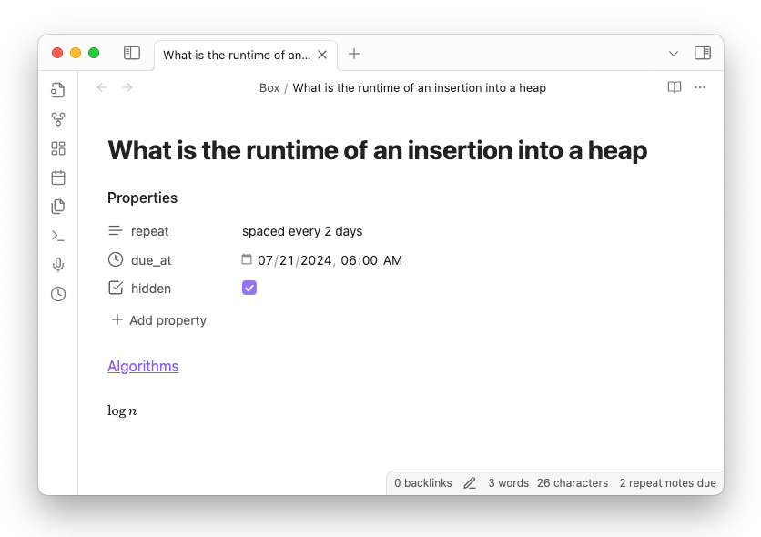
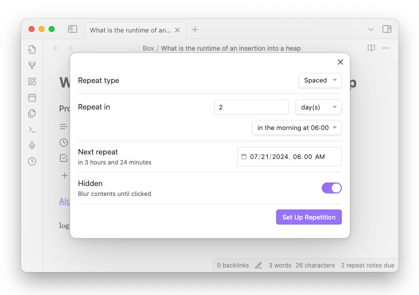
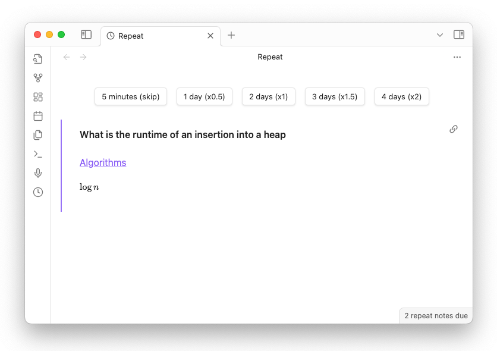
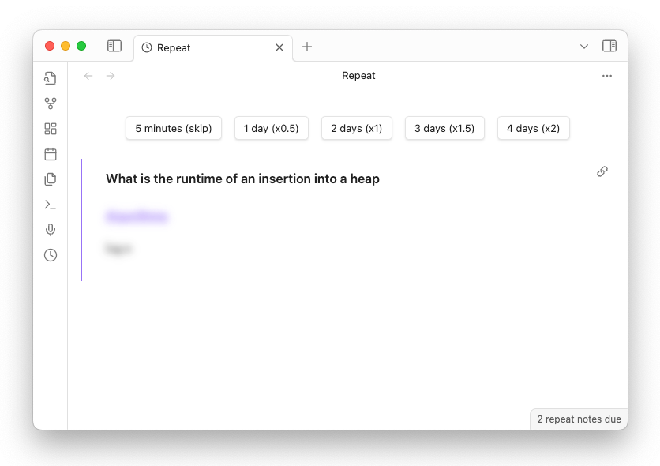

# Obsidian Repeat Plugin

**Review notes using spaced repetition from right within Obsidian.** Mark a note for repetition with one of the built-in commands, or by adding the `repeat` property to the note. Notes become "due" according to the schedule recorded in the `repeat` property, and show up in a dedicated Repeat view inside Obsidian.

For example, a note marked with `repeat: every week` will be due every week on the day of its first review. A note marked with `repeat: spaced every month` will first be due in a month, then some time between half a month and two months in the future, depending on what you picked during its first review, and so on. The plugin automatically computes the due date and stores the result in a `due_at` property. That way, all the repetition information is easy to understand and edit.

A few other goodies are available:

*   You can choose to make the note's body obscured during reviews (`hidden: true`) to make one-sided flashcards.
*   Notes due in more than a week become due in the morning (you can configure the time in the plugin's settings), so that you can have a predictable daily review time.
*   Notes are non-repeating by default, but you can also explicitly mark them with `repeat: never` to disable reviews (useful for programmatic or bulk marking).

## Mark a note for repetition

You mark a note for repetition by specifying the `repeat` property. The `due_at` property is automatically added after your first review. The `hidden` property is optional, and will obscure the body of your note during reviews (clicking on the note's body will reveal its contents).



A note can have a periodic or spaced repetition schedule. Notes using **periodic repetition** become due after a fixed amount of time has passed since the last time they were due. Some valid `repeat` values for periodic repetition are of the form:

*   `daily`, `weekly`, `monthly`, `yearly`
*   `every day`, `every week`, `every month`, `every year`
*   `every K days`, `every K weeks`, `every K months`, `every K years` (where `K` is a number)
*   `every tuesday`, `every monday, friday`, `every tue, wed, thu`, `every sat and sun` (specific days of the week)

Notes using **spaced repetition** become due after a period that you choose during each review. To use spaced repetition, just add `spaced ` to the start of a note's `repeat` value. So:

*   `spaced daily`, `spaced weekly`, `spaced monthly`, `spaced yearly`
*   `spaced every day`, `spaced every week`, `spaced every month`, `spaced every year`
*   `spaced every K days`, `spaced every K weeks`, `spaced every K months`, `spaced every K years` (where `K` is a number)

You don't have to edit these values directly: you can also use the **`Repeat: Repeat this note...` command** to mark a note for repetition using a modal.



Notes become due in the morning. You can add ` in the evening` to the end of the repeat value if you want a note to be due in the evening instead, e.g., `repeat: every day in the evening`. By default "morning" means 6 AM and "evening" means 6 PM, but you can change these times and the default repetition interval in the plugin's settings.

Notes *without* the `repeat` property simply don't repeat. You can also explicitly mark a note as non-repeating with `repeat: never` (or `off`, `no`, or `false`), which can be useful if you periodically mark recent notes for repetition.

## Review notes as they become due

To review notes, open the Repeat view in Obsidian by clicking the "clock" icon, or using the `Repeat: Review due notes` command. In this example, the `repeat` value is `spaced every 2 days`.



Clicking one of the buttons above the embedded note will update the note's `due_at` and (possibly) `repeat` property values.

### Extreme detail about how due dates are calculated that you don't really need to know

Notes using periodic repetition will be due one period *in the future* relative to their previous due date. For example, if it's July 2024 and a note has `repeat: every year` and `due_at: 1999-01-01`, then after review the note will have `due_at: 2025-01-01T06:00:00`. That way, your periodic due dates remain equally spaced even if you stop reviewing your notes for a while.

Notes using spaced repetition become due in whatever time you click relative to the current time. So, if you clicked `3 days (x1.5)` in the example above, that note would be due in 3 days. At the same time, the `repeat` value would be updated from `spaced every 2 days` to `spaced every 3 days`.

Clicking the `5 minutes (skip)` button always just bumps the `due_at` value by 5 minutes (without changing the `repeat` value) so that ignoring a note for the moment doesn't change it's repetition dynamics.

The spaced period multiples `(x0.5), (x1), (x1.5), (x2)` never change. Some other spaced repetition apps like in Anki or SuperMemo 2 calculate the repetition multiples dynamically. This gives you more fine-tuned repetition intervals, in some sense, at the expense of a lot more state per note. One of the design goals of Obsidian Repeat Plugin is to store all repetition state in the note's frontmatter properties, and make all of it easily understandable and editable. I think the tradeoff is good: using a fixed exponential-ish scheduling strategy still allows for a lot of flexibility for when you review, while also meeting this design goal.

All you really need to make a note repeating is add a valid `repeat` value. If there is no `due_at` value, the plugin will still pick up the note for review and calculate the `due_at` value after the review. So you can quickly mark notes for review using this property without worrying about technical details

The `hidden` property enables you to use one-sided flash cards. A note marked as `hidden: yes` (or `on`, or `true`) will have its contents obscured until you click in in a review.



`repeat` values have to be in a supported form, but still use relatively natural language. This way, it's easy to mark a note for repetition using relatively natural language (`repeat: every 3 days`) instead of dealing with some computer-friendly syntax. With that said, the plugin will always save `due_at` values using `hours` as the repetition unit. For this reason, shortest repetition interval is one hour.

Finally, the plugin changes the frontmatter properties it uses in-place, so your other properties are never changed.

### Custom Repeat view styling

The plugin uses Obsidian's native embedding styles to display notes during reviews. So, you can customize those styles and the customizations will be reflected in the plugin. The plugin wraps the embeds in a `<div class="repeat-embedded_note">` element, so that you can customize *only* the plugin's styles.

One useful customization (shown in the screenshots throughout) is making embedded note's titles **bolder**. To do that, create a new CSS snippet (via Settings > Appearance > CSS snippets) containing

```css
.repeat-embedded_note .embed-title {
    font-weight: 600 !important;
}
```

## How to install Obsidian Repeat Plugin

Go to **Obsidian's community plugins list** (via Settings > Options > Community plugins > Browse) and install:

1. Dataview Plugin (used for querying notes)
2. Repeat Plugin

## Additional resources

*   **Development**:
    - Pull requests are welcome. If you have a significant change in mind, create an issue to discuss it with the community first. You may also find some issues with the "help wanted" tag in the Issues tab of [the plugin's GitHub repo](https://github.com/prncc/obsidian-repeat-plugin).
    - To start a local dev build, run `yarn install` and then `yarn dev`.
*   **More Tools**: The `add_repeat_to_notes.py` script from [https://github.com/prncc/obsidian-scripts](https://github.com/prncc/obsidian-scripts) allows you to interactively add the `repeat` field to notes in your existing vault. The Repeat Plugin will be able to pick up those notes from there.
